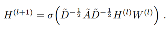

# پیش‌بینی پیوند با شبکه‌های عصبی گرافی LPGNN
<div dir="rtl"> 
در این پروژه، مدل‌های مختلف تعبیه‌سازی و شبکه‌های عصبی گرافی  را برای تسک پیش‌بینی پیوند(link prediction) بررسی می‌کنیم.

</div>

## Requirements
<div dir="rtl"> 

برای ساخت مدل‌های تعبیه‌سازی و شبکه‌های عصبی گرافی، نیاز داریم تا کتابخانه‌های زیر نصب شود:
</div>

- Stellargraph
- Gensim

<div dir="rtl"> 
کتابخانه stellargraph برای پیاده‌سازی شبکه‌های عصبی گرافی است که فقط زبان پایتون با نسخه‌های بین 6 تا 8 را پشتیبانی می‌کند. برای پیاده‌سازی الگوریتم Node2Vec (که به صورت درونی از word2vec استفاده می‌کند) از کتابخانه Gensim استفاده می‌کنیم. دستور نصب کتابخانه‌های بالا به صورت زیر است:
</div>

``` console
 pip install stellargraph gensim==3.8.3 numpy pandas matplotlib 

 ```

<div dir="rtl"> 
همچنین در هنگام نصب stellargraph به صورت درونی، کتابخانه tensorflow نیز نصب می‌شود.
</div>


## Dataset
<div dir="rtl"> 
مجموعه داده مورد استفاده در این پروژه، شبکه جهت‌دار ارتباطات کاربر-کاربر توییتر است که شامل 23370 گره و 33101 یال است. این شبکه بدون ویژگی گره و یال بوده و برای ساخت مدل‌ها، جهت شبکه نیز لحاظ نشده است. اطلاعات تکمیلی مجموعه داده در لینک زیر موجود است:
</div>

http://konect.cc/networks/ego-twitter/  

## node2vec
<div dir="rtl"> 
به طور خلاصه این روش به صورت درونی از word2vec استفاده می‌کند، با این تفاوت که به جای دنباله‌ای از کلمات، دنباله‌ای از گره‌ها را که از قدم تصادفی(با تبعیض قدم‌گذاری در سمت ساختار محلی یا ساختار کلی) بدست آمده است، به عنوان ورودی به مدل word2vec ارسال می‌کند. 
</div>


## Graph Convolutional Network (GCN)
<div dir="rtl"> 
. به طور خلاصه، در هر لایه شبکه عصبی گرافی کانولوشنی، اطلاعات همسایگان مرتبه آن لایه را به صورت هنجارسازی شده(در اینجا براساس ضرب تعداد همسایگان گره اصلی و گره منتقل‌کننده پیام) تجمیع می‌کند. نمایش عنصر به عنصر و گرافی آن به صورت زیر است:
</div>




## GraphSAGE
<div dir="rtl"> 
کاربرد این مدل برای شبکه‌های بزرگ و چگال می‌باشد که پیچیدگی زمانی و محاسباتی اجرای شبکه عصبی گرافی چالش اصلی است. بدین منظور، این مدل از همسایگی گره نمونه‌گیری می‌کند و به جای کل گراف، بر روی زیرگراف بدست آمده، پردازش را انجام می‌دهد.
</div>


## Reference
- Grover, A. and Leskovec, J. (2016), “node2vec: Scalable Feature Learning for Networks”, Proceedings of the 22nd ACM SIGKDD International Conference on Knowledge Discovery and Data Mining, ACM, San Francisco California USA, pp. 855–864.
- Hamilton, W.L. (2020), Graph Representation Learning, Morgan & Claypool Publishers, San Rafael, California.
- Hamilton, W.L., Ying, R. and Leskovec, J. (2018), “Inductive Representation Learning on Large Graphs”, arXiv, 10 September.
- Kipf, T.N. and Welling, M. (2017), “Semi-Supervised Classification with Graph Convolutional Networks”, arXiv, 22 February.
- Lu, L. and Zhou, T. (2011), “Link Prediction in Complex Networks: A Survey”, Physica A: Statistical Mechanics and Its Applications, Vol. 390 No. 6, pp. 1150–1170.
- Wu, Z., Chen, H., Zhang, J., Liu, S., Huang, R. and Pei, Y. (2021), “A directed link prediction method using graph convolutional network based on social ranking theory”, Intelligent Data Analysis, Vol. 25 No. 3, pp. 739–757.
- Zhang, M., Cui, Z., Neumann, M. and Chen, Y. (2018), “An End-to-End Deep Learning Architecture for Graph Classification”, Proceedings of the AAAI Conference on Artificial Intelligence, Vol. 32 No. 1.

